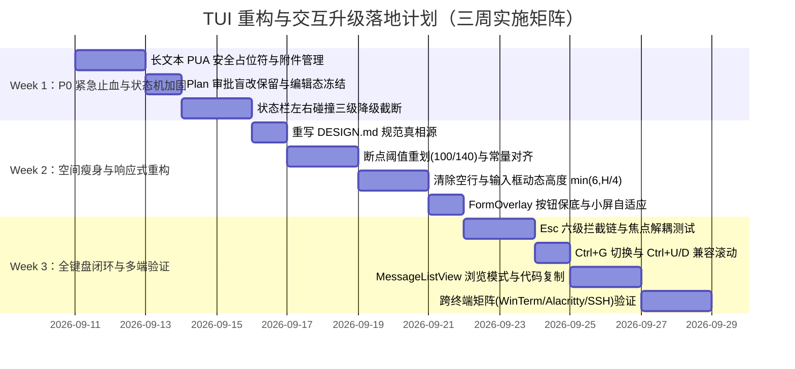

# OneCode TUI 设计系统重构与交互体系全景优化计划

> **文档状态**：核准规划稿（经 6 项工程深度复核修正）  
> **制定时间**：2026-09-10  
> **目标**：破除现存 `DESIGN.md` 与工程代码脱节、概念错配（Web px 硬套终端字符网格）等沉疴；重构 TUI 规范真相源；解决底部 Chrome 空间过度侵占、全键盘无障碍断层、长文本粘贴丢内容、Plan 盲改等核心交互 Bug；建立兼具紧凑高视口、弹性断点响应式、纯键盘双模流式操作的现代 CLI AI 编程工作台。

> **⚠️ 变更记录（2026-09-11 实施修订）**：
> 1. **浏览模式（Browse Mode）剔除**：~~§1.2/模块 3 的对话区漫游浏览模式（`Ctrl+O` 进入、`browse:*` 动作族、`InteractionContext.Browse`）经产品决策整体剔除~~**【已作废：§1.2 浏览模式演进段、§四 Browse/Ctrl+O/Ctrl+D 翻页矩阵行、Week 3.3 浏览模式任务均不再执行，以本条为准】**——滚动需求已由不切焦点的转发键（Shift+Up/Down、Ctrl+PgUp/PgDn、Ctrl+U）覆盖，且 `MessageListView.CanFocus=true` 动摇全局单焦点模型基石（历史依据：`Ctrl+T` Transcript 导航已于 commit c731b49 判定 obsolete 删除）。`DESIGN.md §5.3` 已同步记录。流式跳底浮标（模块 3.4）保留。
> 2. **Ctrl+D 冲突消解**：~~§四 按键矩阵中 Global `Ctrl+D = app:exit`（保留键）与 Chat `Ctrl+D = 半屏翻页` 自相矛盾，且 Resolver「后匹配生效」+ Chat 上下文恒活跃会导致退出键被永久遮蔽成死键。裁定：**Chat 不绑定 ctrl+d**（保留退出键），跨终端兼容翻页仅保留 `Ctrl+U`（pageUp）。~~**【已落实：`KeybindingDefaults` Chat 块无 `ctrl+d`，`NonRebindable` 锁定 + `KeybindingReservedExitTests` 锚定；Overlay/表单同样不得占用 `Ctrl+D`，见 `FormOverlay.OnKeyDown` 注释】**
> 3. **动态高度公式修正**：§1.3/§4.1 原公式 `Clamp(H/4, 3, 6)` 在 24 行终端得 6 行，与"24 行上限 4 行"承诺矛盾。修正为 `Clamp(H/6, 2, 6)`（24 行 → 4 行：1 分隔线 + 3 编辑行）。
> 4. **附件生命周期对账补强**：在 §1.4 基础上新增 `PendingAttachmentRegistry.PruneMissing`——文本变化（含 Editor 内部撤销、全选重打、程序化整体替换）后按「注册表 ∩ 文本」剔除孤儿附件；`ChatTextEditor` 对 Up/Down/Ctrl+Left/Ctrl+Right 的落点做 Token 边界吸附，堵住嵌入编辑撕裂 Token 的静默丢字路径。
> 5. **计划文档自检（2026-09-11 复核）**：§1.2 的 Browse 分级演进段、§四矩阵的 `Ctrl+O/browse:*` 行与 `Ctrl+U/Ctrl+D` 双翻页行、Week 3.3 的浏览模式任务均为剔除前的残留文字，不再执行；`Compact<100` 仍为并排挤压（`drawer-overlay` 未实现），窄屏自动隐藏待后续立项。

---

## 一、 现存系统核心矛盾与 6 点工程风险复盘

在对 `src/OneCode.App/Tui/`（94 个源码文件）与现行 `DESIGN.md` 进行地毯式核对并结合深层工程风险审查后，确立了本次重构必须正面解决的 6 大核心矛盾与防御边界：

### 1.1 断点算术自相矛盾（阈值与常量联动修正）
- **原设计失误**：曾规划 `Standard(90~130列): 侧栏<=30%，主区>=65列`。然而 $90 \times 30\% = 27$ 列，但侧栏下限为 28 列，导致 $28 + 65 = 93 > 90$ 列，在 90~92 列区间发生严重物理溢出。同时 `SidebarViewBase.ComputeMaxWidth` 现状为上限 60%，且 `ChatColumnMinWidth = 20` 过小。
- **纠偏方案**：
  - 断点重定为：`Compact < 100`，`Standard 100~140`，`Wide > 140`。
  - 在 Standard（100~140）下，侧栏占比弹性限制为 $25\% \sim 30\%$（28~42 列），主会话区保底宽度 `ChatColumnMinWidth` 提升至 65 列。
  - 在最小 100 列时：侧栏 28 列 + 分隔线 1 列 + 主区 71 列 = 100 列，恒满足 $\ge 65$ 列保底要求。
  - 同步重构 `SidebarViewBase.ComputeMaxWidth`，在拖拽与键盘两条 clamp 路径上统一对齐。

### 1.2 键盘浏览模式（Browse Mode）与现有焦点模型冲突
- **现有焦点架构现实**：`MessageListView.CanFocus = false` 是全局焦点假设的基石（`ReplShell.Keyboard.cs:17 HasInputFocus` 兜底、`ChatInputView` 转发）。一旦将其直接设为 `CanFocus = true`，会导致 `HandleInteractionKey` 双重触发与事件拦截死锁。
- **纠偏方案**：
  - **【已作废：Browse 漫游方案整体剔除，以头部变更记录第 1 条为准；以下仅保留历史背景，不再执行】**
  - **明确 Esc 六级严密拦截链**（按绝对优先级降序）：
    1. `ActiveOverlay != null`（模态浮层活动）$\rightarrow$ 仅关闭顶层 Overlay；
    2. `Autocomplete.IsShowing`（补全浮层显示）$\rightarrow$ 仅关闭补全菜单；
    3. `InlineSelector.IsActive`（选择器激活）$\rightarrow$ 取消选择器；
    4. `AgentRunner.IsRunning`（后台任务执行中）$\rightarrow$ 发送取消信号（Cancel Task）；
    5. `CurrentContext == InteractionContext.Browse`（浏览模式激活）$\rightarrow$ 退出浏览模式，焦点还给 `ChatInputView`；
    6. `ChatInputView.HasInput`（输入框有文本）$\rightarrow$ 清空当前行；
    7. 其他 $\rightarrow$ 无动作。
  - **按键架构闭环**：在 `InteractionContext` 引入 `Browse`，在 `KeybindingDefaults.AllContexts + ActiveContexts` 建立互斥链路，同步更新 `keybindings.json` 与 `docs/keybindings.md`。
  - **终端转义序列降级保护**：鉴于 `Alt+Up/Down/PgUp` 在 SSH 与 Windows ConPTY 下容易退化为普通方向键，侧栏与会话长翻页主力键采用兼容性 100% 的 `Ctrl+U / Ctrl+D`（类 Vim 半屏翻页）及 `Ctrl+Up / Ctrl+Down`，`Alt` 键仅保留为辅助别名。

### 1.3 输入框高度压缩过激与防抖防御
- **原设计失误**：现状 `MaxHeight = 5`（1 行横线 + 4 行编辑），若强行硬切为固定 2~4 行，在多行 prompt、5 行以上代码编辑、长 `/review` 说明场景下体验倒退。此外，Terminal.Gui v2 中每次 Height 变化都会触发全量 `SetNeedsLayout()`，在流式输出并发时会导致全屏闪烁。
- **纠偏方案**：
  - 最大高度改为视口动态自适应：`MaxHeight = Math.Clamp(windowHeight / 4, 3, 6)`。在 24 行终端上限为 4 行，在 40+ 行终端可优雅展开至 6 行。
  - 输入框高度变化引入**行数防抖检测**，仅在物理换行增加或减少时触发重算；`MessageListView` 采用 `Pos.AnchorEnd(reservedBottom)` 底部相对锚定，严防流式输出并发时的布局抖动。

### 1.4 粘贴字典的占位符碰撞与生命周期管理
- **原设计漏洞**：字面量 `[Pasted #N]` 是用户可逐字手打的 ASCII 文本，正则回填时会误展开用户手工输入的同形字符。且现存 `_pendingImages`（`[Image #N]`）与粘贴文本共存时缺乏统一管理，缺少 Undo 栈支持。
- **纠偏方案**：
  - 引入 Unicode 私有使用区（PUA）Token：内部使用不可手工键入的控制字符包围 `\uE001#N\uE002`，界面呈现为友好的 `[Pasted #1]`，底层正则绝不匹配手打的普通方括号。
  - 建立统一的 `PendingAttachmentRegistry`，统筹文本折叠（`TextFold`）与图片附件（`ImageAttachment`），保证提交、取消、清空时生命周期原子对齐。
  - 对接 TextEditor 的 Undo 栈与光标跳跃逻辑，杜绝光标落入 Token 内部造成半截删除。

### 1.5 视觉调色板变更解耦（规避破坏性 Breaking Change）
- **原设计失误**：将“Teal 单核化”作为模块 1 的顺手改动，严重低估了修改 `TuiPalette / TuiTheme` 对全量主题、Overlay 边框及快照测试的破坏面。
- **纠偏方案**：
  - **代码层本期严格维持调色板现状不变**（继续保留 `accent` 蓝与 `accent-teal` 双轨，绝不动 `TuiPalette` 与快照测试基线）。
  - 仅在 `DESIGN.md` 中以“设计演进愿景”记录未来的语义化意向，代码重构与调色板完全解耦。

### 1.6 里程碑排期理性重构
- **原排期失误**：94 个 TUI 文件 + 快照测试 + 跨终端环境（Windows Terminal、Alacritty、SSH/ConPTY）在 24/30/50 行矩阵的手工验证，7 天绝对无法完成。
- **纠偏方案**：
  - 重新拆解为稳健扎实的 **3 周分阶段落地路线（3-Week Phased Roadmap）**，按 P0 紧急止血 $\rightarrow$ 空间瘦身与断点 $\rightarrow$ 全键盘闭环稳步推进。

---

## 二、 全新设计系统架构（三大支柱）

```text
┌────────────────────────────────────────────────────────────────────────┐
│                        现代响应式 AI 终端工作台架构                     │
├────────────────────────────────────────────────────────────────────────┤
│ 【支柱 1】基于字符单元格（Cells）的三档响应式断点系统                    │
│   • Compact (<100 列): 纯单栏沉浸, 侧边栏退化为 Drawer 抽屉浮层 (Ctrl+G)│
│   • Standard (100~140 列): 弹性侧边栏 (25%~30%, 侧栏28~42, 主区>=65列)  │
│   • Wide (>140 列): 并列双栏 (侧边栏固定 40~45 列, 主区>=95 列)         │
├────────────────────────────────────────────────────────────────────────┤
│ 【支柱 2】极简高密度空间布局（底部常驻 9 行 -> 紧凑 4~6 行）           │
│   • 移除多余空行 (TopGap = 0, ContextGap = 0)                          │
│   • 输入框采用 min(6, Height/4) 视口自适应弹性伸缩（单行时仅 2 行）    │
│   • 视口底部相对锚定，防御全量重排抖动                                 │
├────────────────────────────────────────────────────────────────────────┤
│ 【支柱 3】纯键盘双模交互（Input Mode vs Browse Mode）                  │
│   • Input 打字模式: 输入文本、Tab 补全、智能 PUA 粘贴                   │
│   • Browse 浏览模式: Space 展开折叠、c 复制代码、j/k 漫游、i 切回打字  │
│   • 建立 Esc 六级拦截链与 Ctrl+U/Ctrl+D 跨终端兼容滚动                  │
└────────────────────────────────────────────────────────────────────────┘
```

---

## 三、 详细技术改造规划

### 模块 1：设计系统真相源重写 (`src/OneCode.App/Tui/DESIGN.md`)
1. **度量体系彻底归真**：
   - 彻底删除所有 `px`、`lineHeight`、`fontSize` 等 Web 伪属性；
   - 采用标准字符终端坐标系统：`Column`（列/宽）、`Row`（行/高）、`Cell`（单元格）。
2. **三档响应式断点规范化**：
   - **Compact (<100 列)**：严禁常驻右侧侧栏；Plan 与 Team 状态通过对话流内卡片呈现，或按 `Ctrl+G` 打开覆盖式抽屉浮层（Esc 退出）；
   - **Standard (100~140 列)**：侧栏最大占比限制为屏幕总宽度的 25%~30%（下限 28 列，上限 42 列），主会话区保底 `ChatColumnMinWidth = 65 列`；
   - **Wide (>140 列)**：侧栏固定在 40~45 列，主会话区拥有极度充裕的代码展示空间；
   - 严格数学不等式：$ScreenWidth \ge ChatColumnMinWidth (65) + SidebarMinWidth (28) + Divider (1) = 94$ 列，在 100 列时留有充足的安全裕量。
3. **真实终端深度与物理层级（Physical Elevation）**：
   - 废除依赖终端色彩配置不可靠的微弱背景灰阶差；
   - 确立以边框字符与焦点驱动的层级法：
     - Level 0（底座/主会话区）：无边框，终端默认背景；
     - Level 1（状态栏/分割线）：单横线 `─` 物理硬隔离，`FgSecondary` 静音色；
     - Level 2（停靠看板/侧边栏）：左单竖线 `│` 分隔，手柄悬停/拖动时切换为双竖线 `║`；
     - Level 3（模态浮层 Overlay）：全包围单线方角 `┌─┐ │ └─┘`；活动顶层使用重点色高亮边框。
4. **调色板规范说明**：
   - 保持现有 `TuiPalette` 代码实现双轨不变，仅在文档中规范各语义槽位的标准用途。

---

### 模块 2：布局空间极致压缩与动态视口自适应
1. **消除冗余空行，重构 `TuiSpacing.cs`**：
   - 将 `StatusBarTopGap` 设为 0，`ChatInputContextGap` 设为 0；
   - 重新计算 `ContentZoneReservedBottom`：
     ```csharp
     // 优化前: 1(TopGap) + 1(StatusBar) + 1(ContextGap) + 1(SessionBar) + 5(Input) = 9 行
     // 优化后: SessionContextBar(1) + StatusBar(1) + DynamicInput(2~6) = 4~8 行 (单行输入时仅 4 行)
     ```
2. **输入框动态自适应与防抖（`ChatInputView.Layout.cs` & `ChatTextEditor.cs`）**：
   - 动态高度计算公式：
     ```csharp
     int dynamicMax = Math.Clamp(Application.Top.Frame.Height / 4, 3, 6);
     int targetHeight = Math.Clamp(lineCount + 1, 2, dynamicMax); // 1 行边框 + N 行文本
     ```
   - **视口抖动防御机制**：
     - 行数防抖检测：仅在 `lineCount` 实际发生增减时更新 `Height`；
     - `MessageListView` 采用 `Pos.AnchorEnd(reservedBottom)`，高度重算通过 `Application.Invoke` 批量应用，防止流式输出到达与输入高度变化交错时的多余重绘。
3. **状态栏左右对撞三级降级保护**：
   - `AgentStatusBar.cs`：
     - 计算左侧内容真实宽度与右侧 Badge 宽度之和；
     - 当总宽度超出 Viewport 宽度时，按降级阶梯收缩：
       - 第 1 级：截短模型名称（如 `claude-3-7-sonnet-thought` $\rightarrow$ `Sonnet 3.7`）；
       - 第 2 级：收起 MCP 细项（隐藏 `· 15t`，仅保留 `MCP: 3s`）；
       - 第 3 级：临时隐藏 LSP 统计；
     - 严格确保右侧 Badge 绝对不覆盖左侧文字；
   - `SessionContextBar.cs`：
     - 工作区路径超长时启用中间智能省略（`E:/.../src/OneCode.App`）；
     - 确保右侧 Token 进度条在小屏下绝不出界。
4. **表单弹层（`FormOverlay.cs` & `SettingsOverlay.cs`）视口保护**：
   - 底部的【保存】与【取消】按钮栏设为绝对底部停靠（`Pos.AnchorEnd(3)`），永远不被挤出屏幕；
   - 中间表单字段容器包裹进带滚动能力的视口或采用多标签页（基础 / 模型 / 高级），保证在 24 行终端下均能完整配置并提交。

---

### 模块 3：纯键盘交互体系与焦点解耦演进
1. **焦点解耦三步演进法**：
   - **Step 1（基础可聚焦）**：在 `MessageListView` 开启只读受控聚焦支持，单测确保输入框与消息列表焦点平滑交接，不破坏全局键盘兜底；
   - **Step 2（块操作落地）**：在消息聚焦态下绑定 `Space`（展开/折叠当前项）与 `c`（无格式纯净复制代码块至剪贴板）；
   - **Step 3（漫游索引完善）**：建立消息块与折叠项的轻量索引，接入 `j` / `k` / `↑` / `↓` 漫游。
2. **Esc 六级绝对拦截链实现**：
   - 在 `ReplShell.Keyboard.cs` 中实现集中式拦截链，杜绝按 Esc 关补全时误杀后台 Agent。
3. **实现 `Ctrl+G` 侧栏切换与跨终端兼容滚动**：
   - 在 `KeybindingDefaults.cs` 中注册 `ActionAppSidebarToggle = "app:sidebarToggle"`，绑定 `Ctrl+G`；
   - 侧栏与长文本键盘滚动主力绑定为 `Ctrl+U` / `Ctrl+D`（兼容性 100%），备用 `Ctrl+Up` / `Ctrl+Down`，保留 `Alt+PgUp/PgDn` 作为辅助别名。
4. **流式输出跳底指示浮标（`MessageListView.Rendering.cs`）**：
   - 当 `_stream.IsStreaming == true` 且用户上滚导致 `_scroll.AutoScroll == false` 时：
     - 在消息视口底部渲染浮标：`↓ 新内容生成中 (按 End 滚到底部)`；
     - 用户按 `End` 或滚轮到底后，浮标消失，恢复 `AutoScroll = true`。
5. **排队命令可见性与可撤回（`OneCodeToplevel.Dispatch.cs`）**：
   - 任务忙碌中入队命令时渲染徽标：`[排队中: 1 条命令 - Esc 取消]`，支持在执行前撤回。

---

### 模块 4：核心交互漏洞修复与状态机对齐
1. **长文本粘贴 Unicode PUA 安全占位符重构**：
   - 引入私有控制字符标记 `\uE001#N\uE002`，UI 呈现为 `[Pasted #1]`；
   - 用户手工键入的 `[Pasted #1]` 不包含 PUA 字符，杜绝占位符碰撞误展开漏洞；
   - 统一建立 `PendingAttachmentRegistry`，统筹文本折叠与图片附件的生命周期；
   - 对接 TextEditor Undo/Redo 栈与光标边界跳跃逻辑。
2. **修复 Plan 审批盲改缺陷（`ReplShell.PlanCard.cs`）**：
   - 用户在 InlineSelector 选择 `edit` 时：
     - **严禁调用 `ClearPlan()`**；
     - 侧边栏标题更新为 `📋 实施计划 · 待修改`，内容保持可见；
     - 焦点切回输入框，预填 `"请按以下意见修改计划："`，供用户对照反馈。

---

## 四、 关键按键矩阵演进（Keybinding Matrix）

| 上下文 (Context) | 按键 (Key) | 动作标识 (Action) | 说明 |
|---|---|---|---|
| **Global** | `Ctrl+D` | `app:exit` | 退出应用（保留键） |
| | `Ctrl+G` | `app:sidebarToggle` | **[新增]** 一键展开/收起右侧 Plan/Team 侧边栏 |
| | `Ctrl+Shift+→` | `app:sidebarWider` | 加宽右侧侧边栏（步进 4 列） |
| | `Ctrl+Shift+←` | `app:sidebarNarrower` | 收窄右侧侧边栏（步进 4 列） |
| | `Ctrl+O` | `chat:browseMode` | **【已作废，不实现】** 浏览模式整体剔除，滚动由 Shift+Up/Down、Ctrl+PgUp/PgDn、Ctrl+U 覆盖 |
| **Chat (输入态)** | `Enter` | `chat:submit` | 提交消息 |
| | `Shift+Enter` / `Alt+Enter` | `chat:newline` | 输入换行 |
| | `Ctrl+V` | `chat:paste` | 智能 PUA 粘贴（长文本安全折叠占位符） |
| | `Escape` | `chat:cancel` | 严格依六级拦截链分发（关补全/中断任务/清空输入） |
| | `Ctrl+U` | `chat:pageUp` | **[新增]** 对话区向上翻页（跨终端兼容 100%；`Ctrl+D` 为保留退出键，任何上下文不得占用） |
| | `Alt+1` .. `Alt+4` | `app:mode*` | 工作模式一键直达 |
| **Browse (浏览态)** | `j` / `k` 或 `↓` / `↑` | `browse:next/prev` | **【已作废，不实现】** |
| | `Space` / `Enter` | `browse:toggleExpand` | **【已作废，不实现】** |
| | `c` / `y` | `browse:copy` | **【已作废，不实现】** |
| | `End` | `browse:scrollToBottom` | **【已作废，不实现】** |
| | `i` / `Esc` | `browse:exit` | **【已作废，不实现】** |
| **Autocomplete** | `Tab` / `Enter` | `autocomplete:accept` | 采纳补全项 |
| | `Escape` | `autocomplete:dismiss` | 关闭补全浮层（不中断任务） |
| **Selector** | `1` .. `9` | `selector:quickSelect` | **[新增]** 数字键直选单选选项 |
| | `Enter` | `selector:confirm` | 确认当前选项 |
| | `Escape` | `selector:dismiss` | 取消选择器 |

---

## 五、 三周分阶段落地路线图（3-Week Phased Roadmap）



### Week 1：P0 紧急止血与状态机加固 (目标：消灭数据丢失与展示硬伤)
- **任务 1.1**：重构 `ChatInputView.Paste.cs`，引入 Unicode PUA 占位符 `\uE001#N\uE002`，建立 `PendingAttachmentRegistry` 统筹图片与文本生命周期，修复代码蒸发与手打碰撞 Bug；
- **任务 1.2**：改造 `ReplShell.PlanCard.cs`，在修改意见流程中冻结保留 Plan 侧栏内容展示，严禁 `ClearPlan()` 盲改；
- **任务 1.3**：在 `AgentStatusBar.cs` 落地三级收缩降级保护，在 `SessionContextBar.cs` 落实长路径中间省略，杜绝字符重叠。

### Week 2：空间瘦身与响应式重构 (目标：释放 35%+ 视口面积与规范归真)
- **任务 2.1**：重写 `src/OneCode.App/Tui/DESIGN.md`，彻底删除 Web CSS 概念，确立三档断点（100 / 140）；
- **任务 2.2**：重构 `SidebarViewBase.ComputeMaxWidth` 与 `ChatColumnMinWidth = 65`，彻底消除 $28+65>90$ 算术冲突；
- **任务 2.3**：重构 `TuiSpacing.cs`（空行置 0），改造 `ChatInputView` 动态高度计算 `min(6, Height/4)`，增加行数变化防抖，消除视口抖动；
- **任务 2.4**：改造 `FormOverlay.cs`，固定底部按钮（AnchorEnd），解决 24 行终端下保存按钮被切除问题。

### Week 3：全键盘闭环与多端验证 (目标：达成键盘第一公民，保障零回归)
- **任务 3.1**：在 `ReplShell.Keyboard.cs` 落地 Esc 六级拦截链，并在 `MessageListView` 开启受控聚焦与单测；
- **任务 3.2**：在 Core 与 App 层注册 `Ctrl+G`（侧栏切换）以及 `Ctrl+U / Ctrl+D` 兼容滚动，同步 `keybindings.json` 与 `docs/keybindings.md`；
- **任务 3.3**：在 `MessageListView` 落地浏览模式（`Space` 展开折叠，`c` 纯净复制代码），增加流式跳底浮标与队列撤销；
- **任务 3.4**：在 Windows Terminal、Alacritty、SSH/ConPTY 三端手动验证 24/30/50 行矩阵，运行 `dotnet test src/OneCode.slnx` 确保全量单元测试与快照测试通过。
